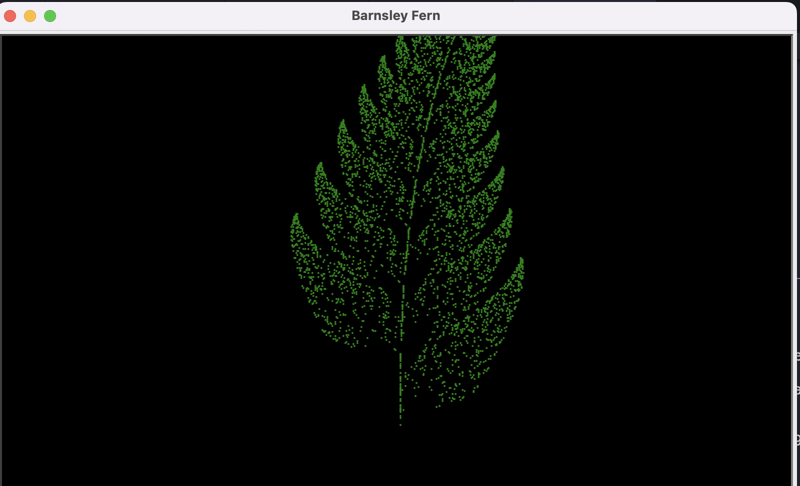

# Barnsley Fern using Turtle Graphics

This Python script generates the Barnsley Fern fractal using the Turtle Graphics library. The Barnsley Fern is a famous fractal pattern created through mathematical transformations. 



## How to Run

1. Ensure you have Python and the Turtle Graphics library installed in your environment.
2. Clone this repository or download the Python script to your computer.
3. Run the script using your preferred Python environment.

## About the Fern

The Barnsley Fern is created by applying four transformations with specific probabilities:

1. Transformation 1: Probability 1%
2. Transformation 2: Probability 85%
3. Transformation 3: Probability 7%
4. Transformation 4: Probability 7%

Each transformation corresponds to a specific set of equations that determine the position of the points.

## Customize the Fern

You can customize various aspects of the generated fern:

- Screen size and background color
- Dot color and size
- Number of iterations

## Example

```python
# Customize the screen size and other parameters
screen.setup(width=800, height=800)
screen.bgcolor("black")

# Customize the dot color and size
fern.dot(2, "green")

# Set the number of iterations
iterations = 100000
