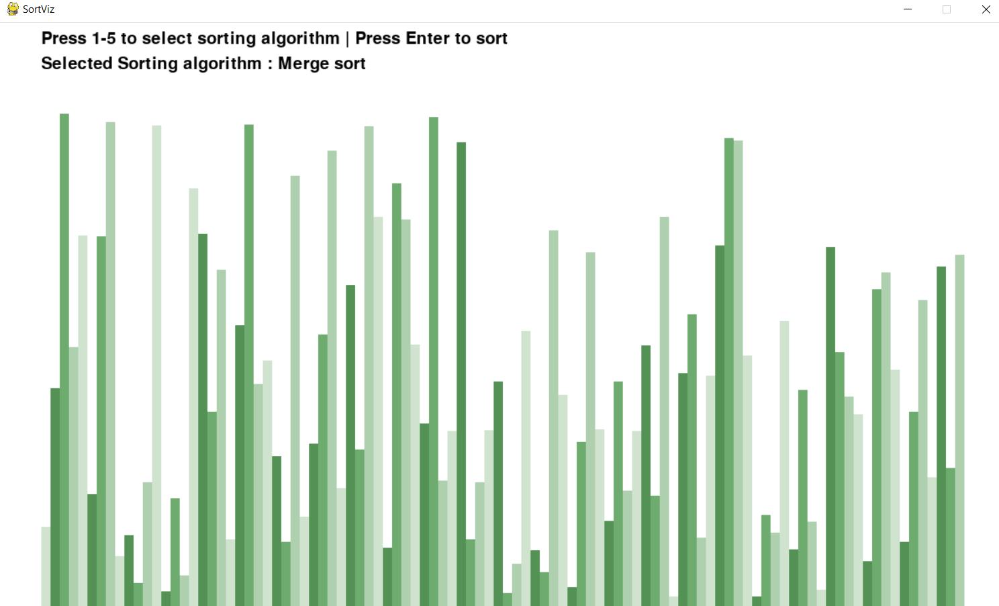
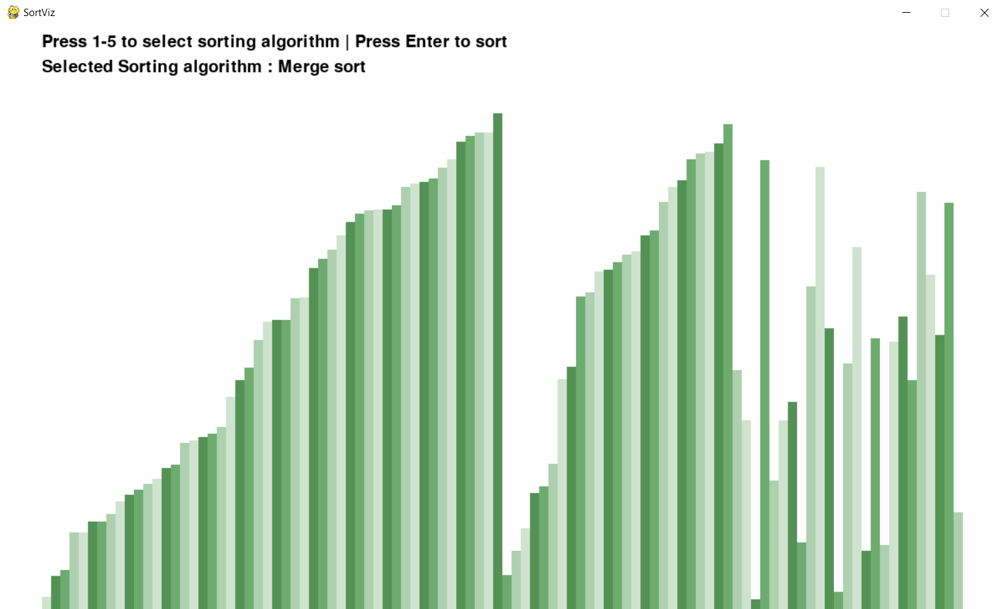

## SortViz

A sorting vizualizer for various sorting algorithms made using pygame.

Requirements
- pygame

Sorting algorithms implemented

- Bubble sort
- Selection sort
- Insertion sort
- Merge sort
- Quick sort

Press the numbers from [1-5] to select a sorting algorithm

Press Enter to start sorting.

Sample images 

